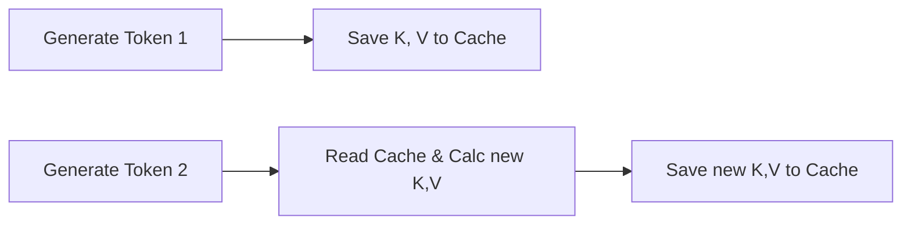
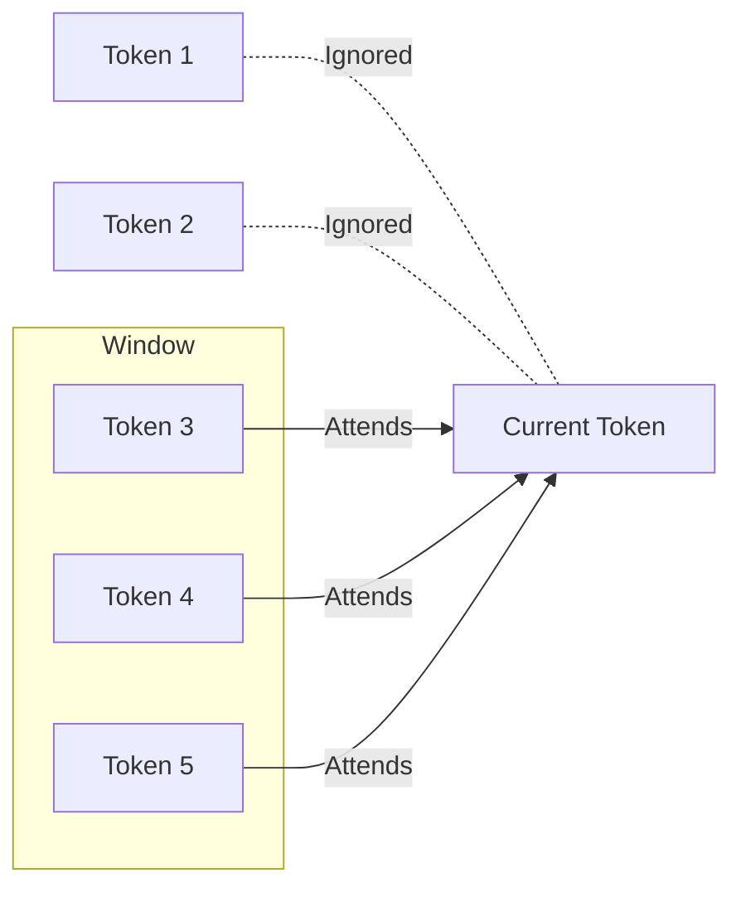
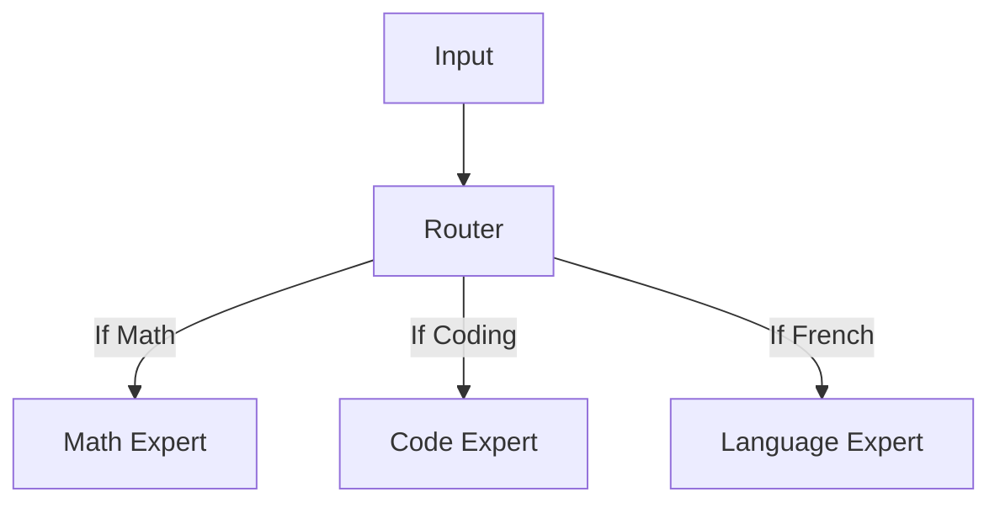
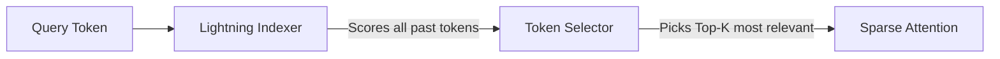

# Chapter 4 Bonus Technologies Explained

This guide explains the advanced Large Language Model (LLM) technologies covered in subfolders `02` to `10` of Chapter 4. These concepts build upon the foundational GPT model and represent the cutting-edge optimizations used in modern models like LLaMA, DeepSeek, and Gemma.

---

## 02. Performance Analysis (`02_performance-analysis`)

**What is it?**
Before diving into optimizations, it's crucial to measure how well the baseline model performs. This section provides tools to measure the speed, memory usage, and computational efficiency of the standard GPT model.

**Why does it matter?**
You can't improve what you can't measure. Profiling the baseline helps you appreciate the speedups provided by techniques like KV caching or specialized attention mechanisms.

---

## 03. KV Cache (`03_kv-cache`)

**What is it?**
When an LLM generates text one word (token) at a time, it normally recalculates the "Attention" for all previous words. The **KV (Key-Value) Cache** saves the previously calculated Key and Value vectors for past tokens in memory so they don't have to be recalculated at every step.

**Why does it matter?**
It dramatically speeds up text generation (inference) by avoiding redundant calculations.

**Diagram:**

---

## 04. Grouped-Query Attention (GQA) (`04_gqa`)

**What is it?**
Standard Multi-Head Attention (MHA) has separate Key and Value heads for every Query head, taking up a lot of memory. GQA groups multiple Query heads together to share a single Key and Value head.

**Why does it matter?**
It reduces the memory footprint of the KV cache significantly without heavily compromising the model's performance. It is widely used in modern models like Llama 3/4, Qwen, and Gemma.

**External Reference:**
- [GQA: Training Generalized Multi-Query Transformer Models from Multi-Head Checkpoints](https://arxiv.org/abs/2305.13245)

---

## 05. Multi-Head Latent Attention (MLA) (`05_mla`)

**What is it?**
Used notably by **DeepSeek V3**, MLA compresses the Keys and Values into a single "latent" (hidden) representation rather than storing massive KV tensors for each head. When the model needs to attend to past tokens, it decompresses this latent vector back into queries/keys/values on the fly.

**Why does it matter?**
It acts as a massive memory-saving technique, drastically reducing the KV Cache size during inference, which is a massive bottleneck for serving long contexts.

---

## 06. Sliding Window Attention (SWA) (`06_swa`)

**What is it?**
Instead of looking at *every single* past word in a document, Sliding Window Attention restricts the model to only look at a fixed "window" of recent words (e.g., the last 4,096 tokens).

**Why does it matter?**
Standard attention complexity grows quadratically ($O(L^2)$) with text length. SWA makes it linear ($O(L)$), allowing models (like Mistral and Gemma 3) to process huge documents efficiently.

**Diagram:**

---

## 07. Mixture-of-Experts (MoE) (`07_moe`)

**What is it?**
Instead of one massive neural network where every part activates for every word, MoE splits the network into multiple smaller sub-networks called "experts". A "router" mechanism decides which 1 or 2 experts are best suited to process the current word.

**Why does it matter?**
It allows a model to have billions of parameters (high capacity for knowledge) while only running a fraction of them at any given time (fast and cheap inference).

**Diagram:**

---

## 08. Gated DeltaNet (`08_deltanet`)

**What is it?**
This is a form of **Linear Attention**. Instead of calculating the relationship between every pair of words (which is slow for long texts), DeltaNet processes information more like a Recurrent Neural Network (RNN). It passes a rolling "hidden state" forward and updates it with a "Delta" (change) at each step.

**Why does it matter?**
It is highly efficient for extremely long contexts (used in Qwen3-Next and Kimi) because it removes the quadratic bottleneck of standard attention entirely.

---

## 09. DeepSeek Sparse Attention (DSA) (`09_dsa`)

**What is it?**
Like Sliding Window Attention, DSA restricts how many past tokens the model looks at. However, instead of a *fixed* local window, DSA uses a **Lightning Indexer** to score all past tokens and a **Token Selector** to dynamically pick only the top-K most relevant tokens to attend to.

**Why does it matter?**
It reduces computation from $O(L^2)$ to $O(L \cdot k)$ without losing the ability to retrieve important information from far back in the context.

**Diagram:**

**External References:**
- [DeepSeek-V3.2 Technical Report](https://huggingface.co/deepseek-ai/DeepSeek-V3.2/resolve/main/assets/paper.pdf)
- [DeepSeek-V3.2-Exp model card & reference code](https://huggingface.co/deepseek-ai/DeepSeek-V3.2-Exp)
- [From DeepSeek V3 to V3.2: Architecture, Sparse Attention, and RL Updates](https://magazine.sebastianraschka.com/p/technical-deepseek)

---

## 10. Cross-Layer KV Sharing (`10_kv-sharing`)

**What is it?**
Normally, every layer in a Transformer model has its own separate KV Cache. Cross-layer KV sharing allows multiple adjacent layers to share the exact same Key and Value representations. 

**Why does it matter?**
It severely cuts down the memory required for the KV Cache. For example, if 4 layers share the same KV cache, memory usage for those layers drops by 75%. This is used in Gemma 4 E2B/E4B to reduce memory usage.
